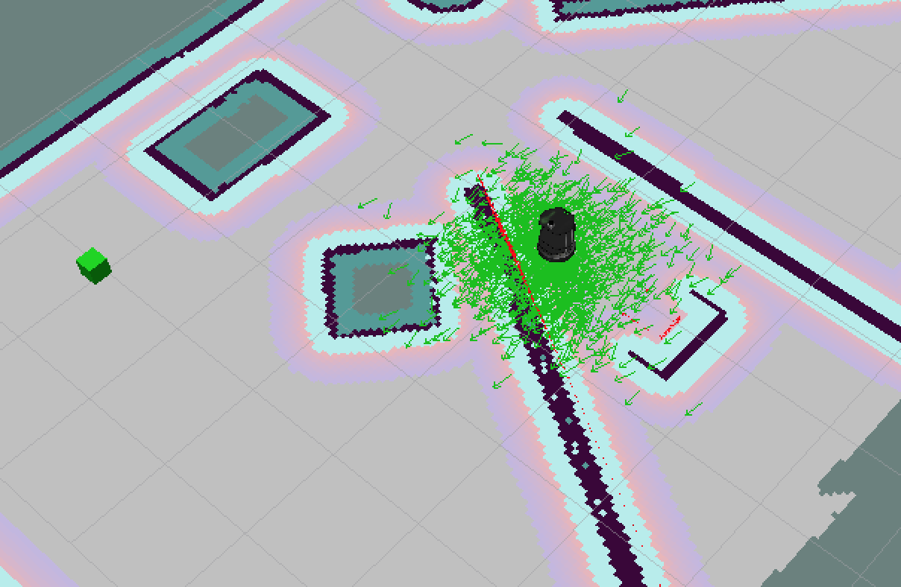

# BotND-05-Home

Project: Home Service Robot

**Setup**
```
cd ~/BotND-05-Home
catkin_make
source devel/setup.bash
export TURTLEBOT_GAZEBO_WORLD_FILE=~/BotND-05-Home/src/turtlebot_simulator/turtlebot_gazebo/worlds/playground.world
export TURTLEBOT_GAZEBO_MAP_FILE=~/BotND-05-Home/src/turtlebot_simulator/turtlebot_gazebo/maps/playground.yaml
```

**1. Mapping**

```
./src/scripts/test_slam.sh 

```
Gmapping is used for mapping. We can drive the robot around to scan the map and use map server to save the map for the next section.


**2. Localization and Navigation**
Part 1 - Navigation stack 

Kill all previous terminals and open a new one
```
./src/scripts/test_navigation.sh 
```
amcl is used here for localization and navigating the robot on the saved 2D map. Using "2D Nav Goal" to send the goal location request to the robot.


Part 2 - Goal node function 
Inside pick_objects.sh, pick_objects_node is called and sending goal requests to the move_base server through a SimpleActionClient

```
./src/scripts/pick_objects.sh 
```
**3. Home Service Functions**
Part 1 - Create virtual objects with markers

Inside add_markers (add_shapes.cpp), it sends messages to visualization_marker to display a cube.

```
./src/scripts/add_marker.sh 
```

Part 2 - Home service

For the final part, the robot state is published inside pick_objects_node.cpp. A publisher is used to send the "state" in uint8_t.
```
  //pub
  ros::NodeHandle n;
  ros::Publisher state_pub = n.advertise<std_msgs::UInt8>("state", 100);
  state.data = start;
  state_pub.publish(state);  
```
When the robot has reached the pickup point, it will publish "arrived_pickup"
```
// Check if the robot reached its goal
  if(ac.getState() == actionlib::SimpleClientGoalState::SUCCEEDED)
  {
    ROS_INFO("Arrived pickup: %f,%f",goal.target_pose.pose.position.x,goal.target_pose.pose.position.y);
    state.data = arrived_pickup;
    state_pub.publish(state);
  }  
```
When the robot has reached the dropoff point, it will publish "arrived_dropoff"
```
// Check if the robot reached its goal
  if(ac.getState() == actionlib::SimpleClientGoalState::SUCCEEDED)
  {
    ROS_INFO("Arrived drop off point: %f,%f",goal.target_pose.pose.position.x,goal.target_pose.pose.position.y);
    state.data = arrived_dropoff;
    state_pub.publish(state);
  }
```
For the marker, we need to subscribe to the "state" and display/remove the marker accordingly.

In pick_shapes.cpp, it subscribed to "state" and call "stateCallback" when there is a new message.
```
ros::Subscriber substate = n.subscribe("state", 100, stateCallback);
```
Marker is deleted for "arrived_pickup", and displayed at an offset to the robot for "arrived_dropoff"
```
void stateCallback(const std_msgs::UInt8::ConstPtr& msg)
{
  uint8_t state = msg->data;

  ROS_INFO("state: [%d]", state);
  
  switch(state)
  {
    case start:  
		    break;

    case arrived_pickup:
        marker.action = visualization_msgs::Marker::DELETE;
		    marker_pub.publish(marker);
        break;

    case arrived_dropoff:
        ROS_INFO("Marker Dropoff");
		    marker.action = visualization_msgs::Marker::ADD;        
		    marker.pose.position.x = 0.2;
        marker.pose.position.y = 0;
        marker_pub.publish(marker);
		break;

	default:
		break;

  }
}
```

Here is the final result
```
./src/scripts/home_service.sh 
```

<a href="http://www.youtube.com/watch?feature=player_embedded&v=0ej-wyt03KI
" target="_blank"></a>
